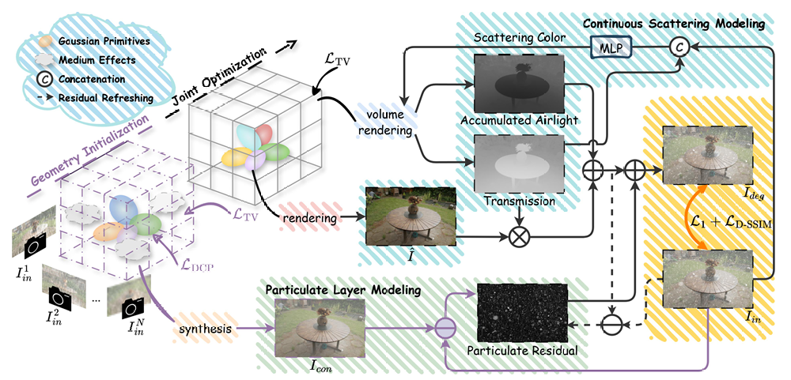

# NimbusGS: Unified 3D Scene Reconstruction under Hybrid Weather

<p align="center">
  <a href="https://github.com/lyy-ovo/NimbusGS">Project Page</a> ·
  <a href="https://arxiv.org/abs/2603.27228">Paper</a> ·
  <a href="https://drive.google.com/drive/folders/1G2HhNbliDudYHBzwoeyvR-5woVkCH1dg?usp=drive_link">Dataset</a>
</p>

<p align="center">
  
</p>

<p align="center">
  <b>NimbusGS</b> reconstructs clean 3D scenes from images captured under haze, rain, snow, and their hybrid weather combinations.
</p>

---

## 📌 Release Plan

- [x] Synthetic dataset
- [x] Training code

---

## 🗂️ Dataset

You can obtain our synthetic dataset here:

👉 **[Download NimbusGS Synthetic Dataset](https://drive.google.com/drive/folders/1G2HhNbliDudYHBzwoeyvR-5woVkCH1dg?usp=drive_link)**

The code follows the original 3DGS / COLMAP-style scene layout. A typical scene should contain camera calibration and input images, for example:

```text
scene_001/
  images/
    000001.png
    000002.png
    ...
  sparse/
    0/
      cameras.bin
      images.bin
      points3D.bin
```

For evaluation, prepare a clean GT directory whose image basenames match the camera image names:

```text
scene_001/
  gt_clean/
    000001.png
    000002.png
    ...
```
---

## 🛠️ Installation

NimbusGS is built on top of the original 3D Gaussian Splatting implementation.  
Please first prepare the upstream 3DGS environment and CUDA rasterization extensions.

```bash
# Install dependencies following the original 3DGS instructions.
# Then install additional Python packages if they are missing:
```
---

## 🚀 Quick Start

### 1. Prepare a Scene

Example layout:

```text
data/
  NimbusGS-Dataset/
    haze_rain_snow/
      scene_001/
        input/
        images/
        sparse/
        clean/
```

Here:

- `haze_rain_snow/` is the degraded input scene used for training.
- `clean/` contains clean reference images used for evaluation.

### 2. Train on a Single Scene

The current training entry uses a YAML config file. CLI arguments can override YAML values.

```bash
python train.py \
  --config configs/haze_example.yaml \
  --source_path data/haze/scene_001 \
  --model_path outputs/scene_001_haze_rain_snow \
  --gt_path data/haze/scene_001/clean \
  --eval
```
---

## 📚 Citation

If you find this project useful, please cite our paper:

```
@misc{li2026nimbusgsunified3dscene,
      title={NimbusGS: Unified 3D Scene Reconstruction under Hybrid Weather}, 
      author={Yanying Li and Jinyang Li and Shengfeng He and Yangyang Xu and Junyu Dong and Yong Du},
      year={2026},
      eprint={2603.27228},
      archivePrefix={arXiv},
      primaryClass={cs.CV},
      url={https://arxiv.org/abs/2603.27228}, 
}
```

---

## 🙏 Acknowledgements

This project builds upon the excellent 3D Gaussian Splatting codebase by GraphDECO-INRIA.  
We thank the authors for releasing their implementation.

---

## 📄 License

This code is released for non-commercial research and evaluation purposes.  
Please also follow the license terms of the original 3D Gaussian Splatting repository and its dependencies.